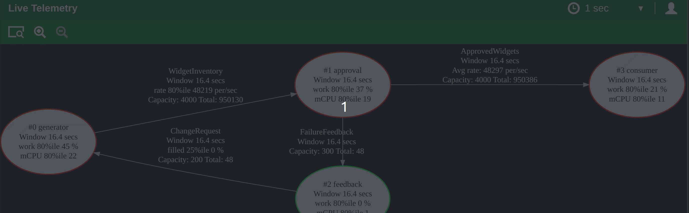

# Steady State: Build Faster, Ship Sooner

**[Watch Our Intro Video](https://twitter.com/NathanTippy/status/1863433128674812398)**  
*See Steady State in action—click now!*

Whether you’re automating factories, commanding robots, syncing IoT devices, or scaling cloud services, **Steady State** is your fast track to reliable,
high-performance systems. Need a smart factory where machines and sensors sync quickly? Or a cloud app that handles millions of requests without flinching?
Steady State nails concurrency, state management, and uptime—so you can innovate, not troubleshoot.

## Why Steady State Stands Out

Steady State isn’t just a framework—it’s your edge. Here’s what it delivers:

- **Ready to Roll**: Telemetry, prometheus, logging, distributed comms built-in.
- **Lightning Fast**: Zero-copy processing and big buffers for top speed.
- **Unbreakable**: Auto-recovery, reliable actor state, safe concurrency. Your app stays alive.
- **Live Insights**: Real-time metrics to keep you in the loop.
- **Pinpoint Timing**: Microsecond precision for workflows that can’t wait.

This is a unified system designed to cut dev time and get you to market fast.

## Built for Speed

Time matters, and Steady State delivers:

- **No Crate Chaos**: Everything you need, no library hunting.
- **Launch Quick**: From MVP to scale-up, move without delays.
- **Automate Smart**: Perfect for factories, makers, and startups... focus on building, not fixing.

## What Can You Build?

- **Factories & Robotics**: Automation control, fault tolerance, and monitoring to keep things running.
- **Cloud Services**: Handle huge loads, zero stress.
- **IoT & Distributed Systems**: Sync devices effortlessly, and compute on the edge.
- **More**: Finance, gaming, makers... Steady State adapts.

  
*See your system live with Steady State’s telemetry.*

## Why You’ll Love It

- **Easy Concurrency**: Multi-core power with isolated actors, easy maintenance.
- **Smooth Shutdowns**: Graceful exits, clean orderly shutdowns for data safe.
- **Instant Monitoring**: Prometheus-ready metrics, no fuss.
- **Pro Testing**: Testing tools to ensure it all works.

## Let’s Shape the Future

Factory automation, robotics, IoT, cloud, services... Steady State makes it simple. It’s serious for business and fun to use. Jump in, try it, and turbocharge your next project. Ready to ship faster?

## Get Started

1. **Begin Here**: Try [minimum example](https://github.com/kmf-lab/steady-state-minimum),[standard example](https://github.com/kmf-lab/steady-state-standard) then explore [robust](https://github.com/kmf-lab/steady-state-robust),[performant](https://github.com/kmf-lab/steady-state-performant) and [distributed](https://github.com/kmf-lab/steady-state-distributed).
2. **Join In**: Shape it on [GitHub](https://github.com/kmf-lab/steady-state-stack).
3. **Support Us**: Back the mission: [sponsor on GitHub](https://github.com/sponsors/kmf-lab).

[**Sponsor Steady State**](https://github.com/sponsors/kmf-lab) | [**Dive In**](https://github.com/kmf-lab/steady-state-minimum)