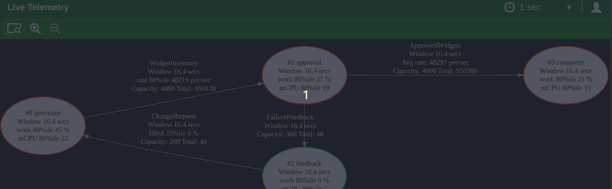

# Steady State

[](https://my.kmf-lab.com/leaderboard/kmf-lab/steady-state-stack)
[](https://my.kmf-lab.com/leaderboard/dashboard?account=kmf-lab)
[](https://my.kmf-lab.com/leaderboard/honor/kmf-lab)

Actor framework for long-running, low-latency Rust services — isolated actors, backpressured channels, supervisors, and live telemetry.

**[Watch the intro](https://twitter.com/NathanTippy/status/1863433128674812398)**

## What you get

- **Isolated actors** — private state, message passing, no shared-memory races
- **Channels with backpressure** — async ring buffers; work waits instead of dropping
- **Supervisors & restarts** — panic recovery with persistent actor state
- **Telemetry & Prometheus** — live graphs and scrapeable metrics out of the box
- **Graceful shutdown** — veto-based coordinated stop so in-flight work can finish
- **Distributed pods** — Aeron for high-speed IPC/UDP between processes and machines

Built for factories, robotics, IoT, and cloud services where uptime and timing matter.

## This repository

Cargo workspace with:

| Path | What it is |
|------|------------|
| [`core/`](core/) | The [`steady_state`](https://crates.io/crates/steady_state) library (published to crates.io) |
| [`cargo-steady-state/`](cargo-steady-state/) | CLI / codegen helper |
| [`docs/spec/`](docs/spec/README.md) | Normative requirements (Tracey / `ss[...]` traceability) |

## Learn by building

Work through the lessons in order — each builds on the last:

| Lesson | Repo | Focus |
|--------|------|--------|
| 1. Minimum | [steady-state-minimum](https://github.com/kmf-lab/steady-state-minimum) | Single actor, timing, shutdown |
| 2. Standard | [steady-state-standard](https://github.com/kmf-lab/steady-state-standard) | Multi-actor pipeline, batching, telemetry |
| 3. Robust | [steady-state-robust](https://github.com/kmf-lab/steady-state-robust) | Restarts, persistent state, peek-before-commit |
| 4. Performant | [steady-state-performant](https://github.com/kmf-lab/steady-state-performant) | Large channels, double-buffering, zero-copy |
| 5. Distributed | [steady-state-distributed](https://github.com/kmf-lab/steady-state-distributed) | Publisher/subscriber pods over Aeron |

In-tree distributed example: [`core/examples/steady-state-distributed`](core/examples/steady-state-distributed).

## Docs map

| Start here | Link |
|------------|------|
| Install & first actor | [docs/getting_started.md](docs/getting_started.md) |
| Architecture TLDR | [steady_state_tldr.md](steady_state_tldr.md) |
| Spec index | [docs/spec/README.md](docs/spec/README.md) |
| Testing actors | [lesson-on-testing.md](lesson-on-testing.md) · [lesson-on-actor-testing.md](lesson-on-actor-testing.md) |
| Bundles & index waits | [lesson-on-bundles.md](lesson-on-bundles.md) |
| Verification (proptest, fuzz, mutants) | [lesson_on_proptest.md](lesson_on_proptest.md) · [lesson-on-fuzz-testing.md](lesson-on-fuzz-testing.md) · [lesson_on_mutations_testing.md](lesson_on_mutations_testing.md) |

API docs: [docs.rs/steady_state](https://docs.rs/steady_state/0.2.13/steady_state/)

## Install

```bash
cargo add steady_state
```

Or in `Cargo.toml`:

```toml
[dependencies]
steady_state = "0.2"
```

Default features include `exec_async_std`, built-in telemetry, and Prometheus metrics. See [getting started](docs/getting_started.md) for executor choices (Windows: use `exec_async_std`).

Crate: [crates.io/crates/steady_state](https://crates.io/crates/steady_state)

## Live telemetry



*Actor graph and channel fill levels in the built-in telemetry UI.*

## Contribute

- [GitHub Discussions](https://github.com/kmf-lab/steady-state-stack/discussions)
- Issues and PRs welcome on this repo
- [Sponsor on GitHub](https://github.com/sponsors/kmf-lab)

[**Sponsor Steady State**](https://github.com/sponsors/kmf-lab) · [**Start with minimum**](https://github.com/kmf-lab/steady-state-minimum)
