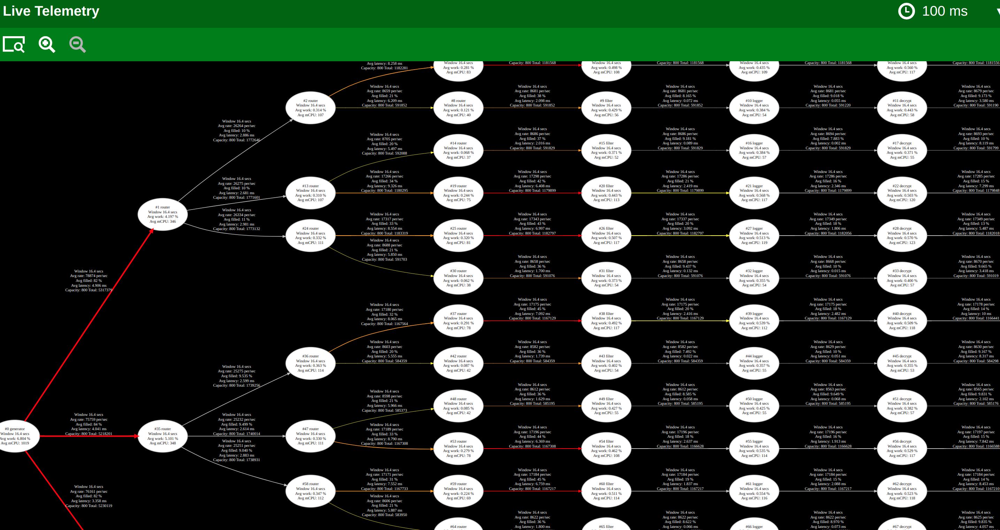

# Our Targeted Values and Goals

## Simplicity
* How can we implement complex behaviors while fully utilizing all available cores?
* How do we efficiently manage systems with numerous business rules without added complexity?
* How can we guarantee a fixed memory footprint for consistent performance?
* How do we deliver dependable service levels that our clients can trust?
### Transparency
* How can we make the system’s interactions clear and understandable to our engineers?
* How can product owners gain visibility into the system's behavior without technical barriers?
* How can operations teams easily monitor the system’s health and status?
* How can we enable rapid diagnosis and resolution of issues to minimize downtime?
### Reliability
* How do we guarantee system availability, no matter the circumstance?
* How can we ensure the system remains consistent, even under stress?
* How can we ensure responsiveness, delivering what’s needed, when it’s needed?
* How do we maintain trust in our services, even in remote or challenging environments?
### Efficiency
* How can we unleash the full potential of our hardware and infrastructure?
* How can we minimize power consumption while maximizing performance?
* How can we extract the most from every CPU cycle to boost productivity?
* How can we reduce latency and delays across the board?
* How can we maximize throughput for optimal business outcomes?

# Steady State: Revolutionizing Resilient Service Development in Rust

SteadyState is a Rust-based framework that simplifies building and managing complex, concurrent systems. It maximizes your hardware’s potential, provides transparency into system performance, and ensures reliability and efficiency. With SteadyState, businesses can deliver powerful software solutions without the complexity, reducing development time and operational headaches, all while keeping your systems running smoothly and consistently.

*An animated GIF demonstrating real-time telemetry visualization in action.*

*A snapshot of a more complex example.*

## Why Sponsor Steady State?

In today's fast-paced digital landscape, businesses require services that are not only high-performing but also resilient and observable. **Steady State** is poised to meet these demands by offering a comprehensive framework that simplifies the development of robust services across various industries, including:

- **Background Services**: Enhance backend processes with high throughput and fault tolerance.
- **Robotics and IoT**: Ensure precise control and clean shutdowns in critical systems.
- **Distributed Systems**: Build scalable architectures with built-in telemetry and performance monitoring.

Your sponsorship will accelerate the development of this groundbreaking framework, enabling features that will benefit the entire Rust community and beyond.

## Key Features

### Flexible Concurrency Management

- **Easy Async**: Simplify asynchronous programming with ergonomic abstractions.
- **Thread Management**: Easily configure actors to run on a single thread or distribute them across multiple threads for optimal performance.

### Clean Shutdown on Signal

- **Graceful Termination**: Ensure all actors in the system shut down cleanly, preserving data integrity and system stability.
- **Ideal for Critical Systems**: Perfect for robotics and IoT applications where orderly shutdowns are crucial.

### Built-in Prometheus Integration

- **Real-Time Monitoring**: Collect metrics out of the box for immediate insights into system performance.
- **Easy Integration**: Seamlessly connect with Prometheus for advanced analytics and alerting.

### Comprehensive Testing Framework

- **Individual Actor Testing**: Isolate and test actors to ensure each component functions correctly.
- **Full Graph Testing**: Validate the entire system's behavior under various scenarios.
- **Mock Actors**: Utilize mock actors for end-to-end and load testing without external dependencies.

## Where Can Steady State Be Used?

- **Backend Services**: Build scalable and resilient microservices.
- **Robotics**: Control complex robotic systems with precise coordination and fault tolerance.
- **IoT Devices**: Manage fleets of devices with reliable communication and clean shutdown capabilities.
- **Financial Systems**: Ensure high availability and data consistency in transaction processing.

## Roadmap

We have an exciting roadmap ahead and your support can make it a reality:

- **Enhanced Test Coverage**: More code coverage for maximum reliability.
- **Video Tutorials**: Produce educational content to help developers adopt Steady State easily.
- **Distributed Actors**: Expand capabilities to support network-wide graphs and distributed computing.
- **Performance Enhancements**: Continually optimize for speed and efficiency.
- **Additional Example Actors**: Provide a library of pre-built actors for common use cases.

## Get Involved

We invite you to be part of this transformative project. Your sponsorship will directly contribute to:

- Accelerating feature development.
- Expanding documentation and learning resources.
- Building a stronger community around resilient Rust services.

[**Sponsor Steady State on GitHub Today**](https://github.com/sponsors/kmf-lab)

  
                             
       