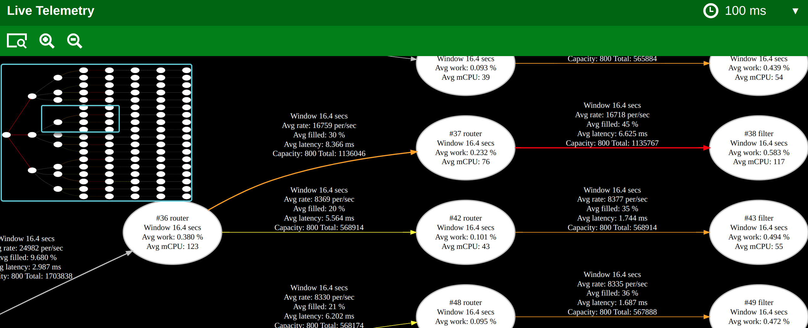

## steady_state: The Next Frontier in Rust Frameworks for Resilient Services
'steady_state' embarks on an ambitious journey to revolutionize the development of resilient, high-performance services in Rust.
With a clear vision of integrating advanced latency management, system observability, and unparalleled fault tolerance, 
steady_state is designed to set new standards in software reliability and efficiency.

*Please note: steady_state is in the early stages of development.
Our early releases are intended to showcase our vision and the framework's potential and  direction.

*An animated GIF demonstrating real-time telemetry visualization in action.*

*A snapshots of a more complex example

## Why `steady_state`?

Named for its commitment to maintaining a consistent, optimal operational state, `steady_state` offers:

- **Fine-Grained Latency Control**: Through customizable batch processing and adjustable channel lengths, empowering developers to meet rigorous SLA requirements.
- **Embedded Observability**: Built-in telemetry features for real-time performance insights, facilitating targeted optimizations.
- **Erlang-Inspired Fault Tolerance**: Leveraging an advanced supervision system to ensure service continuity, even in the face of unexpected failures.

## Core Features

`steady_state` is crafted to ensure safety, reliability, and performance, focusing on:

- **Safety and Concurrency**: Harnessing Rust's memory safety features and actor-based supervised threading for secure, durable, manageable concurrency.
- **High Throughput**: Engineered for handling high message volumes with consistent processing capacity, crucial for demanding systems. Actors can consume and produce messages in batches for greater efficiency.
- **Visibility**: Find and fix performance bottlenecks quickly with built-in telemetry, enabling real-time monitoring and analysis of your service's operational state.
- **Rapid Prototyping**: Mock up your ideas in graphiz DOT files, then generate your Rust service project to get started.

# New project code generation is well underway.
- * You will write a small graphiz Dot file with clear annotations in the labels
- * The code generator will take that and rough in your new project so you can start to add business logic.
- * We are building a ChatGPT prompt so you can have a discussion with it about your product and then have it build the dot for you. 

## ALSO: I am open to work 
https://www.linkedin.com/in/nathan-tippy-985211/

## Vision and Roadmap

`steady_state` is more than just a framework; it's a vision for building the future of service development in Rust. Our roadmap includes:

- **Prebuilt Actors for Cloud Services**: Simplifying the integration with popular cloud platforms and services.
- **Cross-Machine Telemetry**: Extending observability across distributed system deployments, essential for comprehensive performance management.

### Commitment to Testing

In `steady_state`, we prioritize rigorous testing to ensure service stability:
- **Individual Actor Tests**: Roughing in tests for each actor to maintain clarity and ease of maintenance.
- **Comprehensive Mock Actors**: Enabling full end-to-end and load testing capabilities for thorough validation of your service architecture without requiring external services.

`steady_state` combines Rust's safety guarantees with extensive code coverage and a supervisor system to offer unmatched stability in service delivery.
