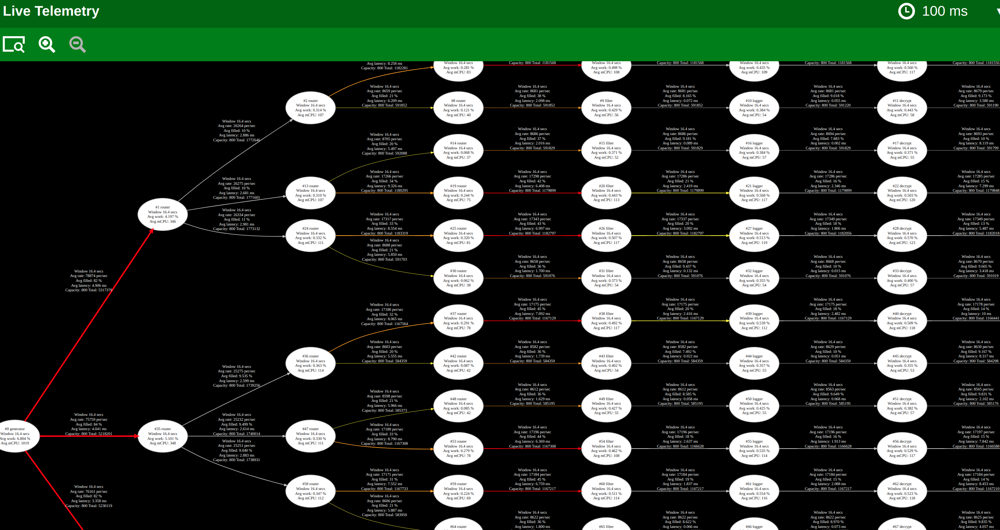

# Steady State: The Foundation of Resilient Rust Services

Welcome to the **Steady State Core**, the backbone of the Steady State framework designed to empower developers to build resilient, high-performance services with ease.

## Overview

The Steady State Core focuses on delivering essential features that ensure safety, reliability, and performance:

- **Safety and Concurrency**: Leverage Rust's memory safety guarantees with actor-based supervised threading for secure and manageable concurrency.
- **High Throughput**: Handle high message volumes efficiently with support for batch processing in actors.
- **Rapid Prototyping**: Use Graphviz DOT files to model your actor graph, then generate Rust code to focus on your business logic.
- **Visibility and Observability**: Built-in telemetry provides real-time insights, enabling you to identify and resolve bottlenecks swiftly.
  
  
  *An animated GIF demonstrating real-time telemetry visualization in action.*

  
  *A snapshot of a more complex example.*
## Key Features

### Built-in Prometheus Integration

- **Metrics Collection**: Automatically gather performance metrics without additional setup.
- **Customizable Metrics**: Extend and customize metrics to suit your application's needs.

### Comprehensive Testing Framework

- **Actor Unit Testing**: Write tests for individual actors to ensure they function correctly in isolation.
- **Graph Testing**: Validate the behavior of the entire actor graph under various conditions.
- **Mocking Support**: Use mock actors to simulate components and external systems for thorough testing.

### Flexible Actor Management

- **Async Made Easy**: Simplify asynchronous operations with built-in support.
- **Thread Configuration**: Assign actors to single threads or have actors share threads for greater scale.

### Clean Shutdown Logic

- **Signal Handling**: Respond to system signals to initiate a clean shutdown sequence.
- **Ordered Teardown**: Ensure actors shut down in a controlled manner to maintain system integrity.

## Getting Started

### 1. Define Your Actor Graph

- Write a Graphviz DOT file with annotations to model your actor system.
- Use clear labels to specify actor properties and relationships.

### 2. Generate Your Project
- Utilize the [cargo-steady-state](https://crates.io/crates/cargo-steady-state) tool to generate your Rust service project from the DOT file.
- Focus on implementing your business logic rather than boilerplate code.

### 3. Implement and Test

- Implement your actors' behavior within the generated framework.
- Write unit tests for actors and integration tests for the actor graph.
- Leverage the built-in testing framework for robust validation.

## Roadmap

- **Enhanced Test Coverage**: Increase code coverage to ensure robustness.
- **Video Tutorials**: Produce educational content to help developers adopt Steady State easily.
- **Distributed Actor Support**: Enable actors to communicate across network boundaries.
- **Performance Optimizations**: Continuously improve processing efficiency.
- **Expanded Actor Library**: Provide more pre-built actors for common patterns.

## Contributing

We welcome contributions from the community. Whether it's bug reports, feature requests, or pull requests, your input is invaluable.

## License

Steady State Core is open-source under the MIT License. You are free to use, modify, and distribute it under the terms of the license.

[**Sponsor Steady State on GitHub Today**](https://github.com/sponsors/kmf-lab)

---

By sponsoring Steady State, you're not just supporting a project—you're investing in the future of resilient, high-performance service development in Rust. Together, we can build solutions that keep businesses moving forward.

---

Feel free to reach out if you have any questions or need further assistance. Thank you for considering supporting Steady State!
                             
       