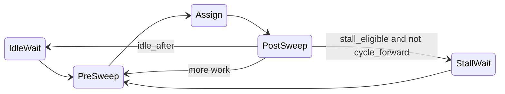

┏━━━━━━━━━━━━━━━━━━━━━━━━━━━━━━━━━━━━━━━━━━━━━━━━━━━━━━━━━━━━━━━━━━━━━━━━━━━━━━━━━━━━━━━━━━━━━━━━━━━━━━━━━━━━━━━━━━━━━━━━━━━━━━━━━━━━━━━━━━━━━━━━━━━━━━━━━━┓
┃ Lesson: Phase Transition State Machines in Steady State                                                                                                   ┃
┗━━━━━━━━━━━━━━━━━━━━━━━━━━━━━━━━━━━━━━━━━━━━━━━━━━━━━━━━━━━━━━━━━━━━━━━━━━━━━━━━━━━━━━━━━━━━━━━━━━━━━━━━━━━━━━━━━━━━━━━━━━━━━━━━━━━━━━━━━━━━━━━━━━━━━━━━━━┛

This lesson explains a **control-flow pattern** we call the **Phase Transition State Machine**: you drive an actor’s `internal_behavior` with an explicit **`enum` of phases**, advance **one bounded step per `while actor.is_running` iteration**, and transition to the next phase with ordinary assignments (`phase = ...`). It pairs naturally with Steady State’s **bounded channels**, **cooperative scheduling**, **telemetry**, and optionally **`SteadyState<S>`** so orchestration can **survive actor restart**.

It is written for **junior and mid-level** engineers. Related lessons: [`lesson-00-minimum.md`](lesson-00-minimum.md), [`lesson-on-bundles.md`](lesson-on-bundles.md), [`lesson-on-troups.md`](lesson-on-troups.md), [`lesson-on-steadystate.md`](lesson-on-steadystate.md), [`lesson-02A-robust.md`](lesson-02A-robust.md), [`lesson-on-actor-testing.md`](lesson-on-actor-testing.md).

────────────────────────────────────────────────────────────────────────────────────────────────────────────────────────────────────────────────────────────

## 1. Why bother? The problem with “one giant iteration”

Steady actors usually look like:

```rust
while actor.is_running(|| /* veto: may I shut down? */) {
    // ... do work ...
}
```

If the body of that loop contains **nested loops** that keep working until some buffer is “dry” (for example, “read every lane until no progress”), you can accidentally:

- **Defer** re-entry to `is_running` for a long time, so **shutdown / liveliness** is checked less often than you think.
- Make **telemetry** (CPU, throughput windows, actor “heartbeat” in dashboards) **lag** the real story: the actor may be busy for a long stretch without crossing the top of the loop again.
- **Starve cooperation** on the same OS thread: in an **actor troupe**, one actor’s long inner loop delays every other member of that troupe (see [`lesson-on-troups.md`](lesson-on-troups.md)).

None of that means “never batch.” It means: **structure long work** so the **outer** loop stays the place where you **regularly** consult `is_running`, and so each tick does **predictable, bounded** work.

**Bounded channels** (see [`lesson-on-bundles.md`](lesson-on-bundles.md)) already give you **predictable backpressure** and SLA-friendly flow control. The phase pattern **aligns your control flow** with those boundaries instead of fighting them with unbounded inner drains.

────────────────────────────────────────────────────────────────────────────────────────────────────────────────────────────────────────────────────────────

## 2. What is the Phase Transition State Machine?

**Informal definition**

- **`Phase` (control state):** where you are in the *orchestration* (“idle,” “sweep once,” “assign,” “stall until room”).
- **Domain state:** what you know about the world—offsets, open files, queues. In Steady State this often lives in **`SteadyState<S>`** (see [`lesson-on-steadystate.md`](lesson-on-steadystate.md)).
- **Single long-lived loop:** exactly **one** `while actor.is_running { ... }`. Inside it, **`match phase { ... }`** runs **one** phase’s worth of work, then sets **`phase = NextPhase`**.
- **Bounded work per tick:** each `is_running` iteration does **at most** one logical pass for the current phase (for example, one round-robin sweep with **one chunk per lane**), not “until the universe converges.”

**PathWatcher** in this repo follows this shape: see [`src/actor/watch_file_path.rs`](../src/actor/watch_file_path.rs). The phase enum is `PathWatcherPhase`; the main loop matches on it and calls `pw_sweep_one_pass` for `PreSweep` and `PostSweep`.

**Local phase vs phase inside `S`**

- **Local `let mut phase`** — simple, zero extra persistence; **lost if the actor panics** before the next successful write to `SteadyState<S>` (if any).
- **`phase` field inside `SteadyState<S>`** — survives **supervisor restart** so you can **resume the same orchestration step** after panic; see section 3.

────────────────────────────────────────────────────────────────────────────────────────────────────────────────────────────────────────────────────────────

## 3. SteadyState and phase: resume after panic (a big Steady advantage)

**The pain elsewhere**

If “what step am I on?” exists only as **stack** variables inside `internal_behavior`, a **panic** clears that stack. After restart, many systems only restart “from the top” of the handler, or you bolt on ad-hoc persistence.

**The Steady pattern**

`SteadyState<S>` is owned by the graph, not by the ephemeral actor body. Put **`current_phase`** (and any small step counters you need) **inside `S`** next to your domain fields. After a restart, `state.lock(...).await` returns the **same** `S`; your code can branch on `s.phase` and **continue** (or enter a dedicated `Recovery` phase that validates `S`).

This is **orthogonal** to **peek-before-commit** on channels ([`lesson-02A-robust.md`](lesson-02A-robust.md)): robust lessons protect **messages**; **phase in `S`** protects **orchestration position** when you need restart continuity.

**Toy C — sketch (pedagogical, not a full graph)**

```rust
#[derive(Clone, Copy, Debug, Default, PartialEq, Eq)]
enum Phase { Idle, WorkOnce, Done }

struct PipelineState {
    phase: Phase,
    items_processed: u64,
}

// Inside internal_behavior, after: let mut s = state.lock(|| PipelineState::default()).await;
// Read:  match s.phase { ... }
// Write: s.phase = Phase::WorkOnce;
// Persisted across actor restart if S is SteadyState<PipelineState> and saved per your config.
```

**When to use which**

| Approach | Pros | Cons |
|----------|------|------|
| Local `phase` | Simplest; no serialization | Lost on panic unless something else persists |
| `phase` in `SteadyState<S>` | **Resume orchestration** after restart | Must serialize if using disk-backed state; don’t stuff ephemeral flags into `S` without reason |

────────────────────────────────────────────────────────────────────────────────────────────────────────────────────────────────────────────────────────────

## 4. Nested / hierarchical phases

Sometimes a **flat** enum explodes (`Ingest_File3_Chunk7_VerifyHash`). A **reasonable** approach:

- **Outer / macro phase:** coarse lifecycle (`Idle`, `Ingesting`, `Flushing`) — good for **telemetry** and **outer-loop cadence**.
- **Inner / micro phase:** nested `enum` or a second field, e.g. `Flushing { step: FlushStep }` where `FlushStep` is `WriteChunk | Fsync | Verify`.

**Rules of thumb**

- Use the **outer** phase when you need a **clear** “we moved to the next major stage” boundary.
- Use **inner** phases for **fine-grained** progress **inside** one stage—still keep each `is_running` tick **bounded** (one inner step, or a fixed cap), so you do not recreate “infinite inner loops.”

**Tiny structural example (illustrative)**

```rust
enum Macro { Idle, Flush }
enum FlushStep { Write, Fsync }

// One representation: tuple of (Macro, Option<FlushStep>)
// Another: enum Top { Idle, Flush(FlushStep) }
```

If nesting gets **harder to read than a flat enum**, prefer fewer phases or extract a **helper function** that implements a small state machine for one stage.

────────────────────────────────────────────────────────────────────────────────────────────────────────────────────────────────────────────────────────────

## 5. Toy examples (pedagogical only)

### Toy A — transitions without I/O

```rust
#[derive(Clone, Copy)]
enum Light { Red, Yellow, Green }

fn next(light: Light) -> Light {
    match light {
        Light::Red => Light::Green,
        Light::Green => Light::Yellow,
        Light::Yellow => Light::Red,
    }
}
```

This teaches **explicit** next-state wiring—no hidden control flow.

### Toy B — idle, work once, stall if stuck

Conceptually (not full Steady APIs):

- **`IdleWait`:** if no work, wait for input (resource-only wait).
- **`WorkOnce`:** do **one** unit of work; set `cycle_forward = true` if something moved.
- **`StallWait`:** if there **was** work to do this cycle (`stall_eligible`) but **`!cycle_forward`**, block until **room** or **new input**—same *idea* as PathWatcher’s `stall_eligible` and `cycle_forward`.

This mirrors **“don’t spin: wait on backpressure”** without copying production code.

### Toy C — tie Toy B to `SteadyState`

Combine **Toy B’s** phases with **`PipelineState { phase, items_processed }`** from section 3: after each successful transition, **`s.phase`** is updated. On restart, log or assert **`s.phase`** so you can see **resume point** in tests (see [`lesson-on-actor-testing.md`](lesson-on-actor-testing.md) for calling `internal_behavior` directly).

────────────────────────────────────────────────────────────────────────────────────────────────────────────────────────────────────────────────────────────

## 6. Why this fits Steady State (bounded, cooperative, observable)

**Bounded channels**

Channel capacity is intentional ([`lesson-on-bundles.md`](lesson-on-bundles.md), [`lesson-02B-performant.md`](lesson-02B-performant.md)). Phases let you **line up** “one pass,” “wait for vacancy,” and “assign” with **backpressure** instead of burning CPU in tight loops.

**Cooperative scheduling**

Actors on a **troupe** share one thread. Shorter outer-loop iterations **yield** control back to the troupe scheduler more often ([`lesson-on-troups.md`](lesson-on-troups.md)). Solo actors still benefit: the **reactor** sees **regular** boundaries for waits and shutdown.

**Telemetry**

Rolling windows and actor stats generally assume work is **chopped** into **observable** slices. If one iteration runs for seconds, dashboards may show odd saturation or “stuck” behavior even when work is legitimate. Phases **do not** replace profiling, but they **align** control flow with **liveness** and **shutdown** checks.

**Async without losing Steady discipline**

Use **`actor.call_async`**, **`await_for_any!`**, **`wait_avail`**, **`wait_vacant_units`** as today’s lessons teach—phases simply **bound** how much you do **before** you **`match`** again.

────────────────────────────────────────────────────────────────────────────────────────────────────────────────────────────────────────────────────────────

## 7. Reference implementation: PathWatcher

The **PathWatcher** actor ([`src/actor/watch_file_path.rs`](../src/actor/watch_file_path.rs)) uses a **local** `PathWatcherPhase` (not stored in `SteadyState` for the phase itself). **Domain** state (`PathWatcherState`: lanes, offsets, etc.) is persisted separately.

**Phases (control)**

| Phase | Role |
|-------|------|
| `IdleWait` | No peeked assignment and no in-flight lane: optional `wait_avail` on assignments; sets `stall_eligible` from “idle at cycle start.” |
| `PreSweep` | One `pw_sweep_one_pass` — round-robin, **one chunk attempt per lane max.** |
| `Assign` | One round-robin pass over free lanes; may assign multiple files in one pass (bounded by `N`). |
| `PostSweep` | Second sweep after new `StartOfFile`s. |
| `StallWait` | If `stall_eligible && !cycle_forward`, drop locks and `await_for_any!` on raw vacancy, ctrl vacancy, or assignment RX; re-lock; then continue. |

**Key locals**

- **`cycle_forward`:** OR’d across PreSweep, Assign, PostSweep for this **cycle**.
- **`stall_eligible`:** snapshot “had work at start of cycle” (historic `!idle` before wait)—stall only when that is true and the cycle made no progress.
- **`last_lane_processed`:** advanced **once per completed cycle** when leaving `PostSweep` (non-stall path) or after `StallWait`—see comments on `PathWatcherState` in the same file.

**Mermaid (illustrative; real transitions are data-dependent)**



**Code anchors**

- Enum: `PathWatcherPhase` — approximately lines 56–70 in [`watch_file_path.rs`](../src/actor/watch_file_path.rs).
- Main loop: `while actor.is_running` with `match phase` — approximately lines 416–618.

────────────────────────────────────────────────────────────────────────────────────────────────────────────────────────────────────────────────────────────

## 8. How this connects to other Steady lessons

| Topic | Lesson | Connection |
|-------|--------|--------------|
| `run` vs `internal_behavior` | [`lesson-on-actor-testing.md`](lesson-on-actor-testing.md) | Phases live in **`internal_behavior`**. `run` stays a thin dispatcher. |
| Unit vs graph tests | [`lesson-on-testing.md`](lesson-on-testing.md) | Test logic by calling **`internal_behavior`** directly; phases give **predictable** steps to assert. |
| Bundles / multi-lane | [`lesson-on-bundles.md`](lesson-on-bundles.md) | PathWatcher sweeps **bundles** with one bounded pass per phase visit. |
| Durable state | [`lesson-on-steadystate.md`](lesson-on-steadystate.md) | Put **`phase` in `S`** when restart must resume orchestration. |
| Message durability | [`lesson-02A-robust.md`](lesson-02A-robust.md) | Complementary: peek/commit protects **channels**; phase in `S` protects **pipeline step**. |

────────────────────────────────────────────────────────────────────────────────────────────────────────────────────────────────────────────────────────────

## 9. Anti-patterns and tradeoffs

- **Unbounded inner “drain until dry” loops** inside one `is_running` tick — brings back shutdown and telemetry issues from section 1.
- **Flat enum explosion** — prefer **nested** phases (section 4) or a **helper** for one complicated stage.
- **Wrong persistence** — putting **`phase` in `SteadyState`** when it is purely ephemeral adds noise; keeping **`phase` only local** when you **must** resume after panic loses recovery.
- **Throughput** — more outer iterations for the same bytes can be **acceptable** in exchange for **better** shutdown latency and observability; you can later add a **knob** (e.g. “up to K chunks per tick”) if profiling demands it.

────────────────────────────────────────────────────────────────────────────────────────────────────────────────────────────────────────────────────────────

## 10. Checklist and further reading

**Checklist**

- [ ] Exactly **one** infinite loop: `while actor.is_running(|| veto)`.
- [ ] **Explicit** `enum` for phases (local or inside `S`).
- [ ] **Bounded** work per iteration for each phase arm.
- [ ] **Resource-only** waits for stall/idle (no busy-spin “fixes”).
- [ ] Decide: **`phase` local** vs **`phase` in `SteadyState<S>`** for restart story.
- [ ] If nested phases: **outer** = cadence / major stage; **inner** = substeps; still **bounded** per tick.
- [ ] Tests: [`lesson-on-actor-testing.md`](lesson-on-actor-testing.md) — call `internal_behavior` for unit tests.

**Further reading**

- [`lesson-on-bundles.md`](lesson-on-bundles.md) — channel bundles and girth.
- [`lesson-on-troups.md`](lesson-on-troups.md) — cooperation and troupes.
- [`lesson-on-steadystate.md`](lesson-on-steadystate.md) — `SteadyState<S>` lifecycle.
- [`lesson-02A-robust.md`](lesson-02A-robust.md) — robust message handling.
- [`src/actor/watch_file_path.rs`](../src/actor/watch_file_path.rs) — phase machine in production code in this repo.

────────────────────────────────────────────────────────────────────────────────────────────────────────────────────────────────────────────────────────────

*This lesson describes a design pattern; always validate against your graph’s shutdown, persistence, and performance requirements.*
